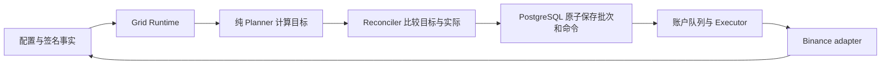

# VENUE 架构

本文描述 alpha.28 的代码结构与当前发布范围；功能入口见 [CODEMAP](CODEMAP.md)，产品行为和验收以 [KOL MVP](KOL_COPY_MVP.md)、[带单同步](LEADER_ORDER_MIRROR.md) 和 [Grid 契约](GRID_RUNTIME_REFACTOR.md) 为准。部署状态须读取实际运行版本，不能由源码或标签推断。

## 1. 产品范围

独立多交易所策略入口见 [MULTI_VENUE_EXECUTOR](MULTI_VENUE_EXECUTOR.md)：另外五所复用相同单例进程、PostgreSQL 账本与密文边界，协议留在 adapter。此扩展的本地验证与逐所实盘验收独立于下述 Binance KOL 发布范围。

Binance KOL、桌面终端和 Binance Grid 面向 Portfolio Margin UM 双向持仓账户，提供 KOL 普通限价挂单同步、桌面终端与事实驱动对冲网格。初期最多 5 个启用 KOL、200 个启用跟随账户；收费结算、策略广场、跨交易所跟单和多 Executor 分片不在本版范围。

五所独立策略与网格走 `multi_venue_*` 和 `DurableAccountGateway`；支撑分批做多当前以 Binance 为参考行情、Bybit LIVE 为执行所。它们已纳入 alpha.28，具体准入和增强门分别见 [多交易所执行](MULTI_VENUE_EXECUTOR.md) 与 [支撑分批做多](SUPPORT_MARTINGALE.md)。旧 Node/Actor/WAL 继续保留冻结兼容边界。

## 2. 进程与职责

| 组件 | 职责与边界 |
|---|---|
| VenueFlow Desktop | Rust + eframe/egui；图表、盘口、账户投影、手动交易和内置机器人列表 |
| Venue Web / BFF | Next.js + React；邀请注册、登录、API 表单和跟单管理；用户 Cookie 与运营会话分离 |
| `venue-control-server` | 认证、归属、凭证加密与只读验证、版本化配置、命令入账、用户作用域查询 |
| PostgreSQL | 用户与关系、密文、配置、源/子单映射、投影、迁移版本和唯一耐久命令账本 |
| `venue-executor-binance` | 单例锁、认证私流与签名恢复、挂单规划、Grid、独立策略、账户调度、物理下单及对账 |
| `venue-leader-bot-admin` | 管理员迁移、带单授权及撤权；不提供公开授权 HTTP 接口，不执行交易 |
| `venue-strategy-admin` | 独立策略凭证、命令、网格及只读诊断；命令入账仍由共享 Executor 执行 |
| 六所 adapter | 签名、校时、规则、原生字段转换与规范订单/仓位事实 |

浏览器经同源 BFF 访问 Control；桌面用自身 Control 会话访问 HTTP/SSE。Control 将命令提交 PostgreSQL 后由 Executor 领取，执行结果和私有投影经 Control 返回对应用户。UI 不自行确认成交。

Executor 在同一进程组装挂单同步、Grid 和私有投影任务，复用账户顺序队列与共享连接。当前全局执行并发上限 32；私有投影按活动需求有界发现，不仅包含 KOL，也服务跟随账户、Grid 和桌面账户。它不为每个账户创建进程或本地恢复日志。

## 3. 模块边界

- `venue-domain` 定义 Symbol、Decimal、订单与持仓等规范类型，不依赖业务模块。
- `venue-control-protocol` 定义版本化客户端协议；Web 的响应转换保持明确白名单。
- `venue-strategies` 的 Grid 和支撑分批纯规划器只根据配置与规范事实计算目标，不接触凭证、数据库或交易所客户端。
- `venue-control` 的 Store 持久化业务状态，Runtime 编排任务，Exchange 层调用 adapter。
- `venue-gateway-*` 封装各所原生差异；同一个 adapter 的新耐久调用和旧 Node 调用分别遵守各自执行边界。
- `venue-indicators` 提供共享指标；旧 Execution/Runtime/Storage 的共享类型与冻结恢复功能必须按实际调用点区分。

Rust workspace 及依赖由根 `Cargo.toml`/`Cargo.lock` 声明；独立 Web 应用使用自己的 package/lockfile。构建版本和资源规则统一见 [开发指南](DEVELOPMENT.md)。

## 4. 账户、关系与机器人

KOL 角色和带单授权是独立状态。用户经邀请注册固定归属一个 KOL；桌面免费注册不创建跟单关系。KOL 托管账户通过专用内部用户与归属映射保存，每个账户独立验证、配置和启用，KOL 不能读取已保存的 API 明文。

同一主账户可保存最多 20 条私有带单配置，包含名称、说明及策略资金；跟随关系当前仍绑定 KOL，因此同一 KOL 最多一条实例处于运行、排空或需处理状态。创建为停止态，停止且无未决工作时才允许编辑。Grid 与带单在桌面统一展示，但各自保持配置和生命周期协议。

当前 profile/robot 仍保存带单账户绑定。用户切换桌面执行账户不能冒充已切换带单源；源切换的目标语义、清理和签名基线边界见 [带单契约](LEADER_ORDER_MIRROR.md)，配套实现需独立验证。

## 5. 挂单同步与 Grid

挂单同步调用链：

`认证账户流 / 签名 REST → 私有订单投影 → order_mirror 规划 → 源/子单映射与命令事务 → 账户队列 → Binance → 精确对账`

只同步机器人与关系启用后符合条件的新普通限价单，保留源价、方向、持仓腿及 GTC/PostOnly。定比和定额在每个跟随关系独立计算；开仓按步长向上取整并满足最低数量/名义额，实际金额不得突破总风险额度。平仓按新鲜可减仓量向下裁剪，旧命令保留已持久化的取整规则。主单部分成交不反复重挂子单；改单先确认旧子单终态并扣除自身累计成交，再建立替代单；主单结束撤销子单剩余量。

市价、Algo/条件单及主从仓位差异不触发追补。旧成交目标模型仅为历史和未决命令恢复保留，不能描述为新关系的复制方式。完整数量、限制与恢复规则统一维护在 [LEADER_ORDER_MIRROR](LEADER_ORDER_MIRROR.md)。

Grid 从配置、签名基线及连续认证私流生成目标订单；Planner 计算，Store 原子提交批次，Runtime 唤醒共享 Executor 补撤。正常热路径复用有效规则与时钟，异常转签名恢复；重启依赖 PostgreSQL 和交易所事实。批内顺序、首次拒单后 30 秒重置及旧账户边界统一见 [Grid 契约](GRID_RUNTIME_REFACTOR.md)。

### Grid 调用链与修改位置

价位、数量和库存决策属于 Planner；触发、恢复、拒单期限及重置阶段属于 Runtime/Store；交易所参数和错误转换属于 adapter。入口只组合任务，文件并不各自对应一个服务。具体文件只在 [CODEMAP 的 Binance Grid 表](CODEMAP.md#binance-grid) 维护。拒单期限由当前 2 秒调度检查触发，不是毫秒级实时保证；配置限制与明确交易所拒单分别处理，不能靠重置绕过数量或金额限制。

## 6. 执行与故障

命令发送前必须提交 PostgreSQL；稳定 `clientOrderId` 和唯一约束约束重复请求。账户内顺序执行，账户间有界并发；单个账户失败不阻止其他账户调度。

`Pending → Sending → Accepted / Rejected / ReconcileRequired → Reconciled`；未发送命令可取消。超时、断线或语义不完整保留原身份查单，不能重新 POST。重启后的 Sending 也先查单；Accepted 不等于成交。

跟单命令按精确签名订单事实确认；Grid 完整匹配的 mutation RESULT 可确认普通 Maker 补撤，身份型 ACK、竞态和不确定结果仍对账。市价和减仓的结算另需实际成交及新鲜签名持仓。PM UM Hedge 普通订单不发送禁止的原生 `reduceOnly` 参数，只减仓意图在领域层和数量裁剪中实现。

暂停/撤权停止新增同步，撤销程序子单剩余量，保留未决身份；已有仓位不自动平仓。详细状态和耐久退避见 [KOL 命令账本契约](KOL_COPY_MVP.md#7-幂等与轻量命令账本)。

## 7. 凭证与授权

Control 使用 Argon2id 密码和服务端会话摘要；API Key/Secret 以 AES-256-GCM 加密，AAD 绑定用户与 credential ID。主密钥来自部署环境，数据库只存密文、掩码及验证结果。

API 明文仅在绑定传输、受信验证和 Executor 内存中短时存在。UI 无解密回显，不把交易所密钥写进本地配置、登录凭据库或日志。Windows 系统凭据库保存的是 Venue 登录资料/会话。

验证 API 与启用交易是两个独立操作。启用需要当前权限、身份、模式、签名账户事实及新旧执行占用检查；保存的 verified 不能代替实时事实。管理员、迁移、Control 运行与 Executor 的数据库角色边界见 [带单契约](LEADER_ORDER_MIRROR.md) 和 [发布指南](DEVELOPMENT.md#executor-release)。

## 8. 冻结兼容与验收

同一真实 `trading_account_id` 只能分配给旧 Node 或新 Executor。旧未决 WAL、Unknown、checkpoint、订单和仓位未安全收敛前，不能删除恢复事实或切换 writer。原三交易所统一接管计划已停止，不再作为新链开发顺序。

源码、离线 fixture、隔离 PostgreSQL、浏览器、目标主机容量和真实 Canary 分别验收。5/200 和 2 核 4 GiB 是容量验收条件；Grid 与 KOL 的延迟按各自契约分段计时，调度周期不是实测延迟。本页不记录易过期的部署状态或宣称实盘性能通过。

## 9. 停用与兼容入口

- 根 `hedged-grid-*` 旧生产 binary、旧 `/v1` KOL 后端和模拟交易 DTO 不恢复为新入口。
- `apps/venue-node` 六个 binary、Stage 7、旧 Copy worker、Actor Applied 及 Runtime/WAL 仍可能涉及冻结调用或恢复；删除需查明依赖和运行账户。
- 根 package 的两个 `verify-grid-*` binary 只读旧工件；名称中的 Shadow 不构成交易运行模式。
- `G:\kol` 是外部 UI 参考，不是 workspace 构建依赖。
- 冻结 Node CLI 见 [NODE](NODE.md)；恢复保护与删除门见 [GRID_RUNTIME_REFACTOR](GRID_RUNTIME_REFACTOR.md)。删除分支引用或文档不改变这些兼容边界。
