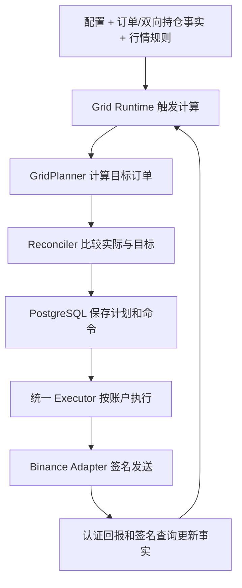

# Binance 网格的开发与运行结构

策略代码按职责拆成多个 Rust 模块，再由一个程序入口组装。文件和目录用于组织代码，不是各自独立运行的服务；`mod` 声明把模块纳入编译，发布时生成 `venue-executor-binance` 可执行程序。修改源码后必须重新编译、部署并重启，服务器才会执行新逻辑。

## 目录与职责

下面只列当前 Binance 网格调用链，不把同目录内冻结的旧 Actor/reducer 实现混入新链。

```text
crates/venue-strategies/src/hedged_grid/
  planner.rs                    纯策略：目标价位、数量、滚动、补库存、盈利减仓

apps/venue-control/src/
  bin/venue-executor-binance.rs  程序入口：组装组件、启动任务、处理关闭
  grid_runtime.rs               网格协调：读取事实，调用策略，推进状态
  grid_runtime/
    driver.rs                   私流事件和定时检查，保证拒单期限得到检查
    fast_path.rs                成交触发的快速重新计算
    reconcile.rs                比较实际与目标，补单、精确撤单、完成 Reset
    batch.rs                    将订单差异组装成耐久命令批次
    fills.rs                    成交归属与分配
    stream_overlay.rs           将认证成交合入订单和持仓投影
    risk.rs                     盈利减仓需要的事实核验
  grid_store.rs                 PostgreSQL 配置、归属和计划的存取入口
  grid_store/
    rejection.rs                从命令账本读取首次明确拒单时间
    convergence.rs              收敛状态、拒单倒计时与重置阶段计时
  executor_runtime.rs           按账户组织命令执行、恢复未决命令
  executor_exchange/            下单准备、发送结果与对账处理

crates/venue-gateway-binance/src/
  execution.rs                  Binance 订单协议适配
  transport.rs                  签名、网络请求与错误分类
  account_stream_projection.rs  认证私流及签名基线维护
```

## 一轮如何运行



Planner 只回答“当前应该有哪些订单”，不接触密钥、HTTP 或数据库。Runtime 回答“何时计算、当前处于什么阶段、哪些差异需要处理”。Executor 和 Adapter 负责实际交易及交易所差异。它们共同运行在一个 Binance Executor 进程里，进程内包含多个异步任务；不同账户各有串行执行队列，同一账户的网格、终端和跟单共享执行边界。

PostgreSQL 保存配置、订单归属和命令状态。请求结果不确定时进入 `ReconcileRequired`，使用原 `clientOrderId` 查询，确认前不重复发送。当前网格通过数据库与交易所事实恢复，不通过旧 Actor/checkpoint/WAL 恢复。

## 首次拒单后 30 秒重置

这属于运行恢复规则，由 Runtime 和 Store 共同实现，不属于计算网格价格的数学公式。

1. Adapter 区分明确拒单与结果不确定；Executor 将明确拒单和终态时间写入命令账本。
2. Store 取当前配置版本的首次明确拒单时间 `t0`，重置期限固定为 `t0 + 30 秒`。后续拒单、计划变化、短暂收敛或进程重启不修改这个起点。
3. 等待期间继续处理成交、补单和精确撤单；事实缺失和未决请求仍遵守安全门。
4. 到期后的调度检查将实例置为 `ResetRequired`，撤销本实例订单，核对真实事实，再重新布网。当前检查周期为 2 秒，因此这是固定期限后的调度触发，不是实时系统的毫秒级执行保证。
5. 重置撤单阶段独立计时，撤净确认后清除计时。旧配置版本的拒单保留在账本中，不会反复重置新网络。

若初装失败，应同时检查规划限制，例如数量向上取整后总开仓挂单名义金额是否超过配置上限；这种配置限制与交易所拒单是不同的失败来源。

## 开发时怎样放代码

增加价位、数量或库存决策，放在 Planner 并做纯函数测试；增加触发、恢复或超时规则，放在 Runtime/Store，并用隔离数据库验证重启、重复回报和未决命令；增加交易所参数或错误码支持，放在 Adapter。程序入口主要负责组合和启动，不把所有业务逻辑堆在入口文件里，也不为每项功能启动一个进程。
