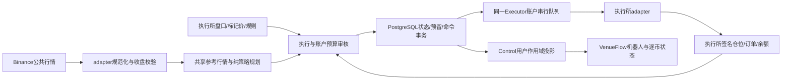

# 支撑分批做多策略：开发与桌面接入契约

本文定义 `support_martingale` 的开发范围、策略规则、执行边界、VenueFlow 桌面交互和验收标准。产品名称为“支撑分批做多（马丁）”。当前源码已完成 Bybit 首个可运行 MVP；盈利能力仍须用持续实盘和样本外回测验证，部署与真实交易结果按每次验收记录判断。

依赖现有[架构](ARCHITECTURE.md)、[多交易所执行](MULTI_VENUE_EXECUTOR.md)和[UI 入口](../apps/ui/README.md)。本策略是独立自营策略；Binance KOL 仍只按原契约同步普通限价挂单，本策略的市价首仓/补仓不会因此自动获得 KOL 复制支持。

## 0. 当前实现状态（2026-09-06）

已实现范围是：`venue-strategies` 的纯规则；Binance USD-M 15m/1h/4h 与 BTC 4h 公共 REST 连续性和新鲜度检查；Bybit 签名账户事实、市价累计成交回读、GTC 只减仓限价止盈；migration 0037 的实例、逐币、支撑身份、预算预留和命令关联；共享 Executor 单账户串行调度与发送前复核；Control 的创建/列表/详情/生命周期接口；VenueFlow 的创建、列表及启动/暂停/等待止盈操作。一个实例可同时运行多个交易对，首个实盘配置固定使用 `SOL/USDT,DOGE/USDT`。

当前止盈使用保守的入场与退出费率上界，界面和状态必须视为估算；Bybit 已结算资金费的逐轮归集是精确净收益展示的增强项。未取得该事实时不把估算收益写成实际净收益，实盘候选使用较低总名义预算保留保证金缓冲。其他四个非 Binance 执行所虽然共享 Durable Gateway，仍须逐所完成本策略的市价、止盈、费用和恢复验收后才能启用；Binance 在本策略中先只作为无凭证参考行情源。

本文后续较当前 MVP 更宽的 capabilities/preflight、人工批量平仓、历史决策明细、资金费精确归集和逐所验收条目属于增强门，不应从文档描述推断已经上线。当前可调用接口以第 9 节明确标注的三类实例接口为准。

## 1. 产品范围与评估结论

一个实例绑定一个执行交易所、一个已验证真实账户和一组交易对；实例内可同时维护多个交易对的多头仓位，所有交易对共用账户资金预算。需要在另一交易所执行时，创建另一个独立账户实例，不提供跨所原子成交、自动换所或失败转单。

| 要求 | 本版约定 |
|---|---|
| 方向 | 只做多；不建立空头或对冲腿 |
| 首仓 | 大周期上涨或已确认震荡环境；关键支撑的局部反弹确认后市价买入 |
| 补仓 | 已有仓位时，大周期下跌也可补；须在更低且未使用的新支撑完成局部反弹确认，使用市价单 |
| 止盈 | 按执行所实际成本计算的普通 GTC 只减仓限价单；不采用触发后市价的 TP Algo |
| 持仓时间 | 不设自动超时平仓；信号有效期和订单超时仍须有界 |
| 止损 | 不设策略价格止损；预算或风险不满足时停止增加风险，继续管理已有仓位和止盈 |
| 行情 | Binance USDⓈ-M 永续行情生成信号；执行所行情、规则和签名账户事实决定能否成交及实际盈亏 |
| 交易对数量 | 候选列表最多 30 个规范交易对，默认最多同时持仓 10 个；全部经过交集和预算筛选 |
| 产品形态 | 首版只接桌面机器人列表与 Control；不新增 Web 策略页面、公共 SDK、插件体系或通用策略 runtime |

“上涨条件失效不补”在本版明确指局部反弹确认失效；大周期下跌不再一律禁止已有仓位补仓。首仓过滤与补仓过滤分别执行，不能用开仓时的旧信号永久授予补仓资格。

**评估：工程上可实现，但当前盈利优势未证实，风险较高。**有限补仓可以降低回本价，也会增加继续下跌的亏损。无止损、无限持仓与有限资金并存，可能长期占资或强平；暂停增险不能保证最大亏损。不能把高平仓胜率、减半预期或“当前低价回升”直接转换为安全系数或补仓豁免。

币安集中提供参考行情便于统一信号和回测，但“用户多”不足以证明每个合约都不受操控，也不能保证执行所价格跟随。低流动性标的、交易所价差、插针、下架、数据中断与稳定币偏离仍需独立处理。BTC 的长期判断也不能外推为所有候选币都会回本。

## 2. 当前可复用能力与缺口

以下为当前源码边界，不能从“有源码”推断已经部署。

| 当前入口 | 可复用内容 | 本策略必须新增或补齐 |
|---|---|---|
| `crates/venue-strategies/src/` | 纯策略包，已依赖 domain 与 indicators | 新的纯规则、支撑识别和持仓轮次规划；不套用对冲 Grid 数学 |
| `crates/venue-indicators/src/chart/` | `Ema`、`Rsi`、`Atr` 与已收盘 `PublicBar` 指标 | 相对成交额、支撑识别属于当前实际需求；复用指标算法，不复制一套 |
| `crates/venue-gateway-binance/src/public.rs` | 1m/5m/15m/1h/4h/1d K 线解析，区分形成中与已收盘 | Executor 的共享参考行情订阅、补缺与策略消费；不依赖桌面市场线程 |
| `apps/venue-control/src/executor_{store,runtime,exchange}/` | Binance 既有命令账本、账户队列、签名恢复及物理执行 | 为该独立策略明确命令 origin、入账、领取、结算和生命周期接线 |
| `apps/venue-control/src/multi_venue_{store,runtime,exchange,credentials,risk}.rs` | 另外五所独立命令、密文和物理网关 | 多币组合预算、在途资金预留、多币一致账户事实及策略 API |
| `crates/venue-execution/src/durable_gateway.rs` | 已入账命令发送、精确撤单和签名减仓边界 | 市价累计成交、实际均价/成交额/费用与资金费的完整结算契约 |
| `apps/ui/desktop/src/{leader_bot_view,grid_view}.rs` | 统一机器人入口、模态配置、凭证及 revision 保护 | 独立策略类型、配置、逐币状态和生命周期 |

特别注意：当前 `multi_venue_*` 的 `StrategyGateway`、凭证枚举和 migration 0035 的 `strategy_venue` 范围是另外五所，不能直接把 Binance 填进去。Binance 应接既有 Binance 执行分支，并为本策略补齐受控入口；不得绕到桌面手动下单或旧 Node。共享 Executor 进程不等于已有完全统一的六所策略 API。

当前 `StrategyRiskLimits` 只有单笔和单交易对上限，不是多交易对组合风控。部分策略快照按单 symbol 读取并覆盖 credential 投影；必须补齐多币账户范围和时效，不能把最近一次快照当作全账户完整事实。现有 `DurableOrderObservation` 的 ID、state、filled_quantity 及限价 Grid 用途，也不足以直接核算市价买入均价和整轮净利润。

当前桌面 `market_client.rs` 的最多 8 个订阅是显示能力；新策略最多 30 个候选、10 个持仓不能受当前图表选择或窗口存活限制。当前 `indicator_projection.rs` 还绑定 Scalping 特征来源，不把它直接当作本策略行情 runtime，Scalping 保持冻结。

## 3. 配置与账户准入

配置存 PostgreSQL，Decimal 用字符串传输，`Symbol` 使用大写 `BASE/QUOTE`。创建即为停止态且不下单；保存、预检和启动是不同动作。以下数值为离线研究起点，必须经费用、精度、资金和样本外验证后才可成为真实启用参数。

| 字段组 | 约定 |
|---|---|
| 身份 | `instance_id`、`credential_id`、执行 `venue`、固定参考源、`revision`；真实账户由服务端解析 |
| 交易对 | 明确候选列表和逐项参考/执行合约映射；默认最多 10 个活动持仓，初始信号同刻按确认时间、规范 symbol 排序 |
| 首仓/补仓 | `first_order_notional=5`，表示执行报价资产名义金额；`max_entries=10` 含首仓；研究默认 `size_multiplier=1.25`，同时测试 1.0 对照 |
| 金额限制 | 单币累计买入额上限候选 1000；账户名义敞口上限、实际分配资金、逐币上限及最大有效杠杆必须明确填写，无“无限”默认值 |
| 杠杆/模式 | 读取执行所真实配置并验证；旧方案的 20 倍仅为候选设置，不自动改账户模式或追加保证金，不充当风险预算 |
| 时间框架 | 候选 4h 环境、1h 支撑、15m 确认；只用已收盘数据 |
| 信号 | EMA20/60、RSI14、ATR14；超卖阈值 35、相对成交额 1.8、回调事件最长 4 根15m线 |
| 止盈 | `target_profit_rate` 和 `minimum_profit_quote` 均显式配置；0.5% 可作为研究候选，按累计真实买入额计，不按保证金收益率计 |
| 执行过滤 | 执行价差、价差变化、盘口深度、预估滑点、事实新鲜度及跨源时间偏差上限；信号确认后有效期候选 `max_signal_age_ms=30000`；缺少必需参数不启动 |
| 等待/冷却 | 全部平仓并清理订单后同币冷却候选 30 分钟；持仓与补仓不重置支撑使用记录 |

首版使用已支持的线性永续及可验证的同一基础资产映射；不扩展现货、反向合约、交割、杠杆代币、封装资产或同名异币。同一实例的执行合约报价、结算和预算使用同一种资产；不同结算资产不混进同一实例。参考源报价不同的映射仅在有新鲜可审计换算事实时准入；USDT、USDC、USD 不默认等值，否则该映射不可用。

运行环境只接受精确 `LIVE`；离线历史回放、fixture 和 mock 是验收手段，不新增测试网、demo 或 Shadow 运行模式。

5U 不满足某交易所最低数量/名义金额时，明确显示“金额不足”，跳过或由用户修改配置；不能自动上调。候选币不足不凑满 30，资金不足不凑满 10 个持仓。

首版一个真实账户只允许一个活动的本策略实例，内部管理多 symbol；不与 Grid、其他机器人、KOL 或手动增仓共用该账户。启动在账户事务中检查真实身份、当前权限/模式、已有 scope、全账户仓位与普通/条件挂单和未决命令；首次启动要求干净账户，重启仅恢复本实例明确归属的事实。已有外部仓位的导入不在本版。

排他必须双向执行：Grid、KOL、终端增仓和旧scope准入同样在现有账户准入锁下检查本策略占用，不能只在本策略启动时检查一次。Running、各暂停态、Draining、NeedsAttention以及仍有仓位/订单/未决命令时均保留占用；未经服务端该检查，其他入口不得新增风险。这里扩展既有账户准入检查，不创建新writer lease。

已保存的 `verified` 只用于选择候选凭证。正在运行的旧账户、未释放 scope 或恢复事实不满足时拒绝启动；不自动停止旧 Grid、释放 writer 或删除 WAL/Unknown/checkpoint。需要迁入时遵循[既有迁入边界](GRID_RUNTIME_REFACTOR.md)，本文不改变该边界。

## 4. 信号的确定性定义

### 4.1 环境分类

候选规则只作为可复现的研究基线，算法参数随配置 revision 冻结，不按回测结果事后改写历史信号。

- 上涨：最近4h收盘 `close > EMA20 > EMA60`，EMA20 高于3根前，且最近已确认4h结构低点未被收盘跌破。
- 下跌：最近4h收盘 `close < EMA20 < EMA60`，EMA20 低于3根前，且最近两组已确认结构高点和低点均下移。
- 震荡：在上述两者均不成立时，于当前4h收盘取最近20根完整4h线（含当前）的最高价和最低价作为上下边界；窗口内各有至少两个已经因果确认的结构高点/低点落在对应边界容差内，间隔至少3根。边界宽度不超过6倍当前ATR14，EMA20的3根变化绝对值不超过0.1倍ATR14，当前收盘仍在区间内。容差为识别该区间时0.25倍ATR，区间版本随本次计算保存。
- 其余为待确认；数据缺失、暖机不足或时间异常为不可用。不得把所有“不上涨”都归为震荡。

首仓要求目标币为上涨/震荡，BTC 环境也为上涨/震荡；震荡首仓必须位于已确认区间下沿的有效支撑。已有仓补仓允许目标币或 BTC 为下跌，但仍必须通过局部反弹及更严格的执行/资金检查；公共数据不可用不豁免。

### 4.2 支撑区及去重

1h候选支撑优先使用两类：已确认局部低点后向上突破前一已确认局部高点形成的结构支撑，以及两根1h收盘突破已确认阻力后形成的回踩区域。局部高低点采用左右各2根确认，平价并列取最早者；只能在右侧确认线收盘后使用，不能回填到低点发生时下单。4h环境的结构点使用同一因果确认方法。

区域以来源价为中心，半宽取形成确认时的0.25倍1h ATR14，边界冻结。重叠区域或间隙小于双方形成时ATR较小值的0.25倍时合并，保留原始标识别名及已有使用状态；不能通过滚动均线、重算、改名或小幅位移创造重复额度。

每个持仓轮次记录 `cycle_id`、`support_id`、来源、形成/确认时间、冻结边界、已使用状态和关联命令。首仓所用区域同样消耗一次资格。补仓支撑必须低于上一使用区域且不重叠，预计成交价低于执行所当前持仓均价。

一次支撑机会只有一份额度。部分成交即消耗该支撑及一次建仓次数；取消剩余量不恢复资格。发送不确定时锁定机会，先按原身份对账。确认零成交的失败也终结本次信号，不立即反复尝试；只有日后该区域的新回调事件才可重新评估未消耗资格。程序重启、暂停恢复或人工部分减仓不清除记录。

### 4.3 局部反弹确认

没有该区域活跃事件时，第一根价格范围与支撑区相交的已收盘15m线启动回调事件，绑定当时的支撑及区间版本。事件内15m RSI14 曾低于35；至少一根已收盘线的报价资产成交额达到前20根已收盘线中位数的1.8倍。分母不含当前线，缺成交额或分母为零则信号不可用。

从触及线起计最多4根15m线（含触及线），出现收盘高于支撑上沿、突破前一根15m最高价且 RSI 回升至35以上，才形成候选买入信号。第4根仍无确认、期间任一1h收盘跌破该支撑下沿、数据不连续、支撑资格已消费或本轮已进入ExitOnly，事件即失效。失效后须先出现一根15m收盘回到区域上方，再等待新的触及事件，不沿用旧放量/超卖条件。此有效期限制信号，不限制持仓时长。

确认线收盘后最多30秒内才可发出该信号的市价单；入队及实际发送两次核验绝对时间，等待撤TP或重连不延长。发送前最新有效参考mid仍须高于支撑上沿且不低于确认线最低价，执行所报价继续通过价差/滑点、补仓低于均价及全部资金门。任一失败终结该信号；它不能在重启、下一根K线或稍后涨回时重新生效。

大周期下跌中的补仓是局部反弹交易，不能把该确认标记为大趋势反转。一次急跌穿越多个支撑只等待当前一个完整新信号，不补齐错过的层数。每个 symbol 同时最多一个待执行增仓意图，连续信号不得排队成为未来必买订单。

## 5. 币安参考行情与执行行情分离



参考行情在共享 Executor 中按 `(reference venue, market kind, symbol, interval)` 去重订阅。桌面关闭、切账户或切图不改变策略订阅。持续运行实例才占用策略订阅；有界暖机、重连退避、REST补缺和连接/速率限制属于这个业务任务，不建立每币独立进程。

策略只接收规范事实及参考源描述，不接触 Binance 类名、原生字段、密钥或物理下单客户端。Binance REST/WS 的现有解析器留在 adapter，网络编排留在 Control/Executor；共享基础指标留在 `venue-indicators`。

WS 未收盘线仅用于显示。历史REST只补齐已结束窗口，按 UTC 开闭时间和 interval 去重；窗口缺口、乱序、未来时间或断线使相关信号失效，完成连续暖机后从下一次新事件恢复，不重放断线期间的买单。保存用于决策的关键输入时间与参数，不另建公共行情 WAL。

| 数据 | 唯一用途和归属 |
|---|---|
| Binance 已收盘价格/成交额 | 环境、支撑、RSI、ATR、放量及参考反弹空间 |
| Binance 新鲜 bid/ask | 参考即时mid与跨所基差；不拿最后一根收盘价当即时价格 |
| 执行所 bid/ask 与足够深度 | 市价买入预估成交价、可成交量、价差和滑点检查 |
| 执行所 mark、保证金与资产 | 名义敞口、权益、保证金及强平压力；币安价格不可替代 |
| 执行所签名订单/成交 | 实际仓位数量、成本、费用、部分成交与订单终态 |
| 执行所资金费和换算事实 | 成本、预算和整轮净收益；缺失不按零处理 |

跨源比较先转成相同基础币数量及预算计价资产。定义 `basis_bps=10000*(execution_mid/reference_mid_converted-1)`，两个mid都来自新鲜bid/ask。检查绝对偏差、同窗口偏差变化、交易所事件时间与接收时间、两源时间差、执行价差、深度和预估滑点；刚收到旧消息不算新鲜。门槛是逐标的/逐所验证后的配置，不假定全币通用的安全值。

现五所 `market_guard` 使用最长5秒行情年龄；新策略门槛不得比下游更宽松，还需独立检查深度、签名账户事实和参考源连续性。不能因15m信号而接受15分钟前的执行报价。基差异常或参考断流停止首仓/补仓，已有执行所只减仓止盈继续维护；执行所事实不可用时保留现有止盈，禁止凭参考价猜测仓位或重挂。

入场前只用参考阻力估计反弹空间：将当前参考价至阻力的收益率应用到当前执行价格，作为候选可达性检查，并扣除价差及成本缓冲；这不是未来基差恒定的承诺。实际止盈限价始终由执行所成本及规则计算，不能把币安支撑或阻力的绝对数值直接发送给另一所。

## 6. 多交易对资金与调度

每个 symbol 有独立持仓轮次、支撑集合与止盈订单；资金准入由同一真实账户统一负责。不同 symbol 可同时持仓，但物理命令按该账户串行执行；不同账户复用现有全局有界并发，不能启动每币 writer。

至少同时限制：单笔名义金额、单币本轮累计买入额、单币当前敞口、账户当前总敞口、有效杠杆、活动币数，以及真实可用保证金。累计买入额在价格下跌或部分止盈后不恢复；当前敞口随市价变化。两者不能混用，否则下跌会被误认为腾出更多补仓资金。

`effective_leverage = all_account_gross_notional / fresh_equity`。账户总敞口包括全账户仓位、开放增仓订单及账本已预留未反映到签名事实的命令；用同一命令身份防止开放单与账本预留双计。外部持仓/订单突然出现则停止增险并对账，不能从风险合计中忽略。分配预算不能高于实际可用资金，未来承诺入金不计入。

额度预留与命令在同一 PostgreSQL 事务中提交：锁账户预算行，校验配置 revision、生命周期、cycle 和信号新鲜度，检查已有命令与支撑资格，预留名义金额/手续费/保证金缓冲，分配顺序号，入账命令。不能在逐币内存中各读同一余额后分别下单。

需要先撤旧TP的补仓分两步：先只持久化业务意图和相应预留，不生成可领取的市价命令；旧TP撤单先入执行队列。撤单终态及最新事实通过后，在同一事务中将原意图预留转为实际命令预留并入账补仓，不重复占额。不再符合条件时终结意图、释放其未消费预留并按现仓维护TP。避免待补仓的账户顺序号排在其前置撤单之前。

发送前重新核对实际权益、未决身份、价格及预算。以盘口预估和有依据的执行价格缓冲向下取数量；原生市价没有硬价格保护时，预检不构成成交价格保证。真实滑点超限或成交后超预算即冻结增险并记差额，不自动止损。确认的终态与实际成交决定预留转消耗及余额释放，`Accepted`、超时和撤单请求不释放额度。

同刻候选采用稳定顺序；至少给止盈维护和对账保留调度容量，不让30个候选信号耗尽现有32条独立策略命令队列。过期信号丢弃，已持仓币的必要对账先行；账户内一笔未知命令可阻塞其他币，UI必须如实显示账户阻塞，不承诺完全逐币隔离。

压力情景包括全币同步再跌20%/40%、单币再跌70%、资金费支出上升、报价资产偏离和保证金门槛变化。它们是研究情景，不是最低价格预测或损失上界。压力通过条件采用用户明确分配资金和允许亏损；未设预算或压力不通过不得新增风险，已有仓位继续计损。

## 7. 市价首仓/补仓与限价止盈

### 7.1 成交与身份

首仓和补仓使用领域 `ExecutionCommand::PlaceMarket`，按执行所精度向下归一基础币数量。持久身份至少绑定账户、实例、run、cycle、symbol、support、动作与决策序号；哈希/编码由既有身份边界完成，不让 adapter 随机改 client ID。

命令状态与订单生命周期分别记录。`Sending` 崩溃、网络超时、部分响应或无法确定结果均保留原 `clientOrderId`，进入 `ReconcileRequired` 查询原单及成交；不自动重发市价请求。不足额成交按真实数量处理，不补齐剩余计划量，不把某所 IOC 结果解释为全额完成。

入场成交后按签名累计成交量、成交额、手续费和新鲜仓位建立成本。重复/乱序 WS 与 REST 用原交易所成交身份或可靠累计量游标去重；零成交、部分成交、手续费迟到均有明确状态。每个 symbol 不能凭 UI 本地回执增加层数。

### 7.2 止盈价格与收益

一个持仓轮次从首笔实际买入开始，直到仓位归零且所有相关订单/未决命令核清结束交易；另保存账务完整状态。迟到手续费/资金费按原成交和持仓结算时段归属原cycle，即使已经开始新轮次也不能记到新轮次。账务未核齐时利润只标记估算，不宣称最终盈利。设累计买入成交额为 `B`，已部分卖出成交额为 `S`，剩余基础币量为 `Q`，已发生交易费用为 `Fee`，资金费净支出为 `Funding`（净收入为负），目标净利润为 `G=max(minimum_profit_quote, B*target_profit_rate)`。

以下买卖成交额与价格必须原生保留在该执行合约的结算/报价资产中；不能把各笔历史名义额先按不同时刻的外汇价格折算后相减，制造虚假合约盈亏。第三资产手续费单独有来源地折算，跨所参考价换算只服务信号/风险比较。在线性合约且预计退出费率上界为 `f_exit < 1` 时：

```text
P_min = (B - S + Fee + Funding + G) / (Q * (1 - f_exit))
P_tp  = ceil_to_execution_tick(P_min)
预计整轮净收益 = S + Q * P_tp - B - Fee - Funding - Q * P_tp * f_exit
```

`Q=0` 不计算价格；数量与金额溢出拒绝规划。费用来源缺失时不能填零；可验证费率上界只能标记为估算。滑点体现在实际买卖成交额中，不再重复扣除。第三资产费用按有来源的汇率折算，缺失标记 `CostsIncomplete`、暂停增险，并保留有效的已有只减仓止盈。

首仓成交而费用明细尚未齐全时，可使用发送前已验证的入场/退出费率上界建立标记为估算的临时TP；不能可靠估算则同时进入 `TakeProfitBlocked`，明确显示当前无有效止盈，继续核账而非无状态等待。交易所签名事实迟到时不得按计划数量虚构持仓。

止盈使用普通 `PlaceLimit`、`Gtc`、领域只减仓意图和 `TakeProfit` 用途，数量不超过签名确认可减仓量，扣除其他已预留平仓量。限价不等于 maker：可成交的 GTC 可能立即成为 taker，手续费按保守可执行费率计算。不能把 `StopMarketFullPosition`、市价平仓或其他触发单当作本需求的止盈实现。

止盈价超出交易所允许范围时不向下压到亏损价、不改成市价；记录 `TakeProfitBlocked`、暂停增险，继续持有和复核。低于最小可平数量的残余持仓保持 `ResidualPosition`，不伪造已平仓、不为凑数量再买。

资金费结算、新成交或费用修正后重新估算目标，仅在价格/数量确需变化时串行替换，防止频繁撤挂消耗限频。费用变化与交易所成交存在竞态，因此“目标净盈利”不保证所有真实退出最终净收益非负；不得隐去事后成本差额。

### 7.3 补仓与旧止盈的竞态

1. 先锁定本次补仓意图，冻结同币其他增仓；按原身份读取旧止盈的累计成交和状态。
2. 精确撤旧止盈，等待明确终态并消费撤单期间的新增成交；不能先挂一张覆盖同份库存的新止盈。
3. 重新读取签名仓位。已经归零则结束轮次并取消补仓；任何止盈部分成交则本轮进入 `ExitOnly`，不再补仓，重挂剩余只减仓限价单。
4. 仍持仓且旧止盈无成交时，重新验证信号、持仓代次和全部资金门；通过后才原子入账市价补仓命令、转移原意图预留并交队列发送，不能提前建立可领取Pending补仓。
5. 查清实际结果，再按真实成本及剩余数量挂新止盈。零成交/拒绝时恢复按现仓计算的止盈；结果未知先对账，不重复补仓。

该流程复用既有账户队列和原身份查单，但不照搬 Grid 的批内 place-before-cancel。撤止盈与重挂之间存在暂时无止盈窗口；仅允许流程中这笔重新通过全部检查的补仓，其他增险暂停。出现任何未决结果则先对账，不能重复补仓；新TP维护完成前不接受下一笔增险。UI显示维护状态，不能宣称原子改单或零空窗。

市价首仓后止盈挂单失败时，同样进入 `TakeProfitBlocked`，只继续对账和限价止盈维护，不再补仓。第一次止盈实际成交后整轮只出不进，避免部分退出与补仓反复消耗预算。

## 8. 生命周期、持久化与重启

实例的用户目标生命周期 `desired_lifecycle` 使用 `Stopped / Running / EntryPaused / IncreasePaused / Draining`，健康状态独立记录 `Ready / NeedsAttention` 及原因；显示的有效状态由两者共同决定。故障恢复不能把原来的暂停或 Draining 自动改回 Running。逐币另有 `Waiting / EntryPending / Holding / AddPending / ExitOnly / Cooldown`，以及对账、费用不完整和止盈阻塞原因。各状态是业务记录，不新增 Actor 或通用运行引擎。

| 桌面动作 | 服务端语义 |
|---|---|
| 启动 | 预检通过后运行；只允许未来新信号，不立即补齐历史信号 |
| 暂停首仓 | 禁止新持仓轮次并取消未发送首仓意图；已发送首仓按原ID对账，可能仍形成持仓。已有仓位仍按规则补仓及维护止盈，按钮明确说明仍可能加仓 |
| 暂停增险 | 禁止首仓和补仓；撤销未发送增险意图，已发送按原身份对账；继续维护止盈 |
| 停止并等待止盈 | 进入 Draining，禁止增险，后台继续维护限价止盈；全部归零并核清订单后才变 Stopped |
| 恢复 | 检查 revision、账户事实、阻塞原因及预算；保留原 cycle/支撑使用记录 |
| 全部市价平仓 | 独立人工动作，二次确认明确账户、币种、数量及可能亏损；封增险、对账并撤旧TP、按新鲜可减仓量发送；失败逐币显示 |
| 删除/更换账户 | 仅完全 Stopped、无持仓/自有订单/未决命令时允许；不重置历史成本或支撑事实 |

停止不代表即时清仓，等待可能无限期；关闭窗口或网络断开不停止服务器策略。人工市价平仓属于用户明确操作，不构成自动止损规则，不得平仓后自动重开。组级与逐币暂停分别记录，恢复组级状态不能解除某币的人工暂停或风控阻塞。

首次版本只有 Stopped 且无仓位、自有订单和未决命令时才允许编辑金额、币池和信号配置，暂停不等于可编辑。持仓中不允许通过换实例、换 credential、改 revision 或删除币种重新获得预算。人工减仓/外部订单导致事实偏离时暂停增险，核对并调整止盈；不自动买回人工减掉的数量。归零前不释放账户占用。

建议新增最小业务表，具体 migration 号在实施时取下一个未占用编号，不能复写0035/0036：

| 建议业务记录 | 内容与唯一性 |
|---|---|
| `venue_support_martingale_instances` | 本人/账户/执行所、配置、revision、生命周期；真实账户活动实例排他 |
| `venue_support_martingale_cycles` | 每币当前及历史轮次，首次成交时间、层数、累计投入、费用游标与决策版本；同实例同币最多一个未结束轮次 |
| `venue_support_martingale_supports` | 冻结支撑、别名合并、使用状态、关联命令；`cycle_id + support_id` 唯一 |
| `venue_support_martingale_decisions` | 信号收盘时间、关键指标摘要、拒绝原因及原命令引用；只保存本策略决策，不复制订单/成交 journal |
| 账户预算行与 reservation | 复用/最小扩展现有Store事务，按 command ID 唯一；跨币预留、实际消耗与终态释放 |

委托身份和执行状态仍在现有 `venue_binance_commands` 账本；签名订单、成交、持仓和费用复用规范事实与可靠消费游标，确有缺口才扩展，禁止新建平行订单账本。支撑是否用过无法从当前仓位推断，必须保存 PostgreSQL；这不构成旧 WAL/checkpoint 恢复模式。

恢复顺序：读取配置/轮次/预留与未决身份 → 先恢复命令对账 → 获取执行账户完整签名事实及成本 → 核清自有止盈并重算预算 → 重建连续参考行情窗口 → 按原支撑集合恢复，从未来新信号继续。来源不完整进入 NeedsAttention，不假设空仓；不删除旧工件、不执行事件回放交易、不为每账户或每币增加 writer lease。

## 9. VenueFlow 桌面与 Control 协议

机器人页在 `execution_view.rs::show → Tab::Bots → leader_bot_view.rs` 增加独立类型，复用现有列表样式，不把本策略伪装成 Grid 或 KOL。建议新增 `support_martingale_view.rs` 和 `client/support_martingale.rs`，文件按职责拆分且遵守2000行上限。

创建入口：“新建机器人 → 支撑分批做多”。首先选执行交易所/账户，再选择交易对；固定显示“参考行情：Binance USD-M”。账户掩码、真实身份摘要、支持的订单/持仓模式与缺失能力由服务端返回，不把当前 `CredentialSummary::selectable()` 的 Binance 双向条件硬套 Hyperliquid Net。

配置模态复用 `grid_view.rs` 的 credential 绑定、`editor_is_current`、revision 校验、pending 保护和底部固定按钮。资金页明确区分名义金额、保证金、累计投入、账户总上限；预检按交易对列出支持/拒绝及原因。保存不运行，启动前呈现最大金额、仍会在下跌补仓、不自动止损和不限持仓的具体配置摘要。

实例列表显示执行所/账户、运行状态、持仓币数/上限、组合敞口、预留金额、含浮亏净收益、止盈阻塞数；展开逐币列表显示环境、局部确认、层数、均价、标记价、真实数量、累计投入、净收益、资金费、止盈价/剩余量、参考/执行价差、持仓时间和下一次拒绝原因。行情/费用不可用显示“—”和时效，不显示伪造零收益。

“持仓(n)”与“当前委托(n)”遵守当前币过滤；逐币详情纵向滚动，费用/金额标注资产。USD汇总仅在有有效估值时展示，不把不同报价资产直接相加。图表支撑带标明 Binance 来源；执行所订单价单独显示，跨所价差不为零时不得默默叠在 Binance 同一价格轴上，若提供换算覆盖必须标为估算。

点击某币只改变查看上下文，不修改运行实例绑定。`client/stream_gates.rs` 的当前账户UI订阅可回收，但服务器策略订阅继续。现桌面手动 PostOnly 下单分支不用于市价首仓或补仓；现有终端确认习惯可复用，但本策略人工平仓还必须先封增险和处理旧止盈。

已新增专用 `crates/venue-control-protocol/src/support_martingale.rs`、`apps/venue-control/src/accounts/support_martingale.rs` 及 HTTP 路由。以下标明当前接口与增强项：

| 接口 | 用途 |
|---|---|
| `GET /v2/strategies/support-martingale/capabilities` | 增强项：本人凭证、交易所能力、报价与合约映射 |
| `POST /v2/strategies/support-martingale/preflight` | 增强项：只读逐币和账户检查；不入账交易，不授予永久发送资格 |
| `GET/POST /v2/strategies/support-martingale/instances` | 已实现：本人实例列表、创建；创建为 Stopped |
| `POST /v2/strategies/support-martingale/lifecycle` | 已实现：带 `request_id + expected_revision + action` 的幂等生命周期请求 |
| `GET /v2/strategies/support-martingale/instances/{id}` | 已实现：实例、逐币状态、资金预留和归属投影 |
| `POST /v2/strategies/support-martingale/close` | 增强项：独立人工市价平仓与逐币结果 |

列表与详情先复用现有约3秒的机器人轮询与请求后即时刷新；执行不依赖轮询，不为本功能另造事件总线。UI mutation 排队立即重绘，显示“请求已接收”等业务反馈不能变成“成交成功”。账户切换、旧 revision、重复点击和过期响应均须受客户端与服务端双重身份检查。

人工平仓目标绑定原请求及当时实例/币种范围，不跟随之后的图表或账户选择；服务端每笔仍按新鲜可减数量裁剪。重复点击或网络超时只查询同一请求的原命令，不新建第二批；明确终态后仍有残仓时，显示残余量并由新的明确人工动作处理。

所有接口使用现有登录会话、用户归属和凭证密文边界，禁止客户端指定任意用户/真实账户或提交原生订单字段；原始密钥、签名、交易所错误响应不回显。接入 HTTPS 时只扩展 `scripts/configure_desktop_https.py` 的精确method/path，不开放任意代理或管理员CLI。

## 10. 实施落点与交易所能力

以下目录/文件为本策略拟新增，只有实际实现时才加入模块声明，不预装空壳：

| 落点 | 当前任务需要的职责 |
|---|---|
| `crates/venue-strategies/src/support_martingale/` | 配置校验、支撑/事件识别、预算输入后的纯规划、成本目标；无网络、数据库、凭证 |
| `apps/venue-control/src/support_martingale/` | `store`、`runtime`、`market`、`risk`、`settlement` 按职责组合；PG事务和既有Executor调度 |
| control-protocol 与 accounts 新模块 | DTO、归属、配置CAS、生命周期和用户投影 |
| desktop 新 view/client | 列表、配置、详情及幂等请求 |
| 现 gateway/execution 模块 | 仅补当前欠缺的规范成交/费用、深度、时效和减仓能力，不另建物理订单客户端 |

现有依赖已覆盖核心需要：tokio、reqwest、tokio-tungstenite、serde、rust_decimal、sqlx、secrecy/zeroize、共享指标。当前没有引入新直接依赖的理由；若实施发现缺口，按项目依赖治理说明实际调用和专项验证。

| 执行所 | 当前分支与本策略准入重点 |
|---|---|
| Binance | 既有 PM UM Hedge 分支；需本策略Store/dispatch/settlement接线。原生禁止的 `reduceOnly` 不发送，按多头腿、可减数量与签名事实实现减仓 |
| Bybit | `multi_venue_*`；正确 `positionIdx`、原生减仓和市场单结果；市价按原生IOC/价格保护，可能未足额成交 |
| Bitget | `multi_venue_*`，当前 UTA v3；adapter按 `posSide/tradeSide` 区分开平，不能统一强塞 `reduceOnly` |
| Gate.io | `multi_venue_*`；原生张数及 `quanto_multiplier` 留在adapter，不能把基础币数量直接当张数 |
| OKX | `multi_venue_*`；`ctVal/ctMult`、`posSide` 与开平方向；Hedge普通委托不机械发送禁止的 `reduceOnly` |
| Hyperliquid | `multi_venue_*`；Net显式Long，已有反向净仓拒绝增仓；“市价”由有价格保护的IOC实现。当前adapter固定保护参数不冒充新策略可配置滑点能力 |

“支持某交易所”必须同时具备账户验证、符号/数量/报价转换、新鲜行情、订单精确恢复、只减仓限价TP和桌面投影；缺一项则能力未就绪。当前设计覆盖六所，不表示六所已全部可运行。首个执行所选择已完成该策略能力和验收的账户，后续按同一契约逐所放行。

## 11. 验收、研究与开发顺序

先完成研究规则和纯函数，再补持久化/执行契约，然后接桌面；实现过程保留一个闭环，不为了提前显示启动按钮而跳过结算和账户预算。

| 门 | 必须覆盖的场景及通过条件 |
|---|---|
| 规则单测 | 已收盘/暖机/未来时间；支撑确认延迟；区域合并去重；震荡不误收所有下跌；大周期下跌仅允许已有仓局部确认补仓；无固定跌幅补齐 |
| 资金单测 | 10币同刻信号只消费一次共享额度；价格下跌不恢复累计投入；部分成交/未决预留；缺汇率/保证金/费用停增险；资金和名义口径明确 |
| 执行契约 | 每所市价首仓/补仓的拒绝、部分、零成交和未知；重复/乱序成交；原ID查询；正确腿位和合约单位；GTC普通限价TP及真实可减数量 |
| 竞态/崩溃 | TP撤单期间部分/全部成交；下单前后崩溃；TP拒绝后禁补；PG提交后UI重试；人工减仓不买回；资金费迟到；残余仓不能结束轮次 |
| 隔离PostgreSQL | 迁移、幂等/CAS、账户排他、跨币预留事务、消费游标、恢复顺序和用户隔离；没有隔离库标记跳过，不用生产库 |
| 桌面 | 多币配置/详情、币数与过滤、跨账户迟到响应、group/单币暂停、停止等待和人工平仓；330×300及更短面板滚动可达、窄模态与DPI、关键按钮可见 |
| 跨所研究 | 同一币安信号使用各执行所自身历史价差/成交条件/费用/资金费；不能用币安K线替另一所模拟成交或强平 |
| 真实交易 | 逐所逐账户小规模授权验证首仓、部分成交、补仓与TP替换、撤单竞态、精确对账、关闭桌面后继续维护；每所独立结论 |

回测连续穿过上涨、震荡、阴跌、急跌反弹和反弹失败，不在月底/年底清空亏损仓。按当时可见币池处理存续偏差，期末未平仓按执行所价格持续计入；入金增加份额，不算交易利润。费用采用实际/保守taker入场费，GTC止盈不假设必然maker；仅有K线高点触达不能证明限价足额成交。

信号确认后只能使用当时随后可获得的执行所报价，并模拟传输、账户排队、撤TP和发送耗时；不能按确认前的支撑最低价成交。同一K线同时触及TP与强平阈值时，用更细数据恢复顺序，无法确定则采用保守结果并标记歧义，不能挑选先止盈的有利顺序。

同一初始资金和组合约束至少对照：不补仓、等额补仓、1.25递增补仓；另外比较允许/禁止大周期下跌补仓、执行所本地信号/币安参考信号，以及同预算分批持有。报告净收益、最大净值回撤及持续时间、最大占资、未结束轮次、预算耗尽率、强平、成交率、滑点和费用敏感性，不只优化胜率。

通过研究的条件由用户风险预算明确：样本外扣费净收益、回撤/占资和压力损失达到事先门槛；递增版本若只改善已平仓胜率、恶化总净值或长期占资，则保留等额版本或否定该信号。不能靠补大本金、剔除深套币或只展示盈利轮次验收。

缺少执行所深度、费用或资金费历史时，允许完成规则研究，但该所执行回测标记未完成。真实带单另验证跟单者漏掉低位补仓、资金不足和成交偏差；本策略开发不改变当前 KOL 市价单不复制的契约，也不自动开通平台带单。

文档阶段仅静态验证。实现后的局部Rust检查/测试统一用 `scripts/Invoke-VenueBuild.ps1` 验证 `venue-strategies`、`venue-control-protocol`、`venue-control`、`venueflow` 和改动adapter；专项脚本已有guard时不二次套锁。跨模块公共契约及发布前按 [DEVELOPMENT](DEVELOPMENT.md) 集中建立全量基线。所有离线、数据库、桌面、逐所真实门分别记录，不以一种通过替代另一种。

## 12. 外部协议依据

以下只说明接口语义，实际实施需按当前版本复核，不作为收益或交易所安全性的背书：

- [Binance PM交易接口](https://developers.binance.com/en/docs/catalog/advanced-trading-derivatives-trading-portfolio-margin/api/rest-api/trade)：UM订单、持仓腿、Hedge原生参数限制及精确查单。
- [Bybit Place Order](https://bybit-exchange.github.io/docs/v5/order/create-order)：市价IOC及保护、限价GTC、持仓腿和减仓参数；请求受理与成交结果需分开处理。
- [Hyperliquid订单类型](https://hyperliquid.gitbook.io/hyperliquid-docs/trading/order-types)、[官方SDK市价实现](https://github.com/hyperliquid-dex/hyperliquid-python-sdk/blob/master/hyperliquid/exchange.py)：IOC与价格保护语义，不能把用户界面“市价”理解为无限价保证成交。
- [资金费](https://www.bybit.com/en/help-center/article/Funding-fee-calculation)与[强平说明](https://www.bybit.com/en/help-center/article/FAQ-Order-Execution-and-Liquidation)：永续长期持仓成本和保证金风险；各所用自己的规则核算。

Binance已收盘参考K线的当前项目契约以 `crates/venue-gateway-binance/src/public.rs` 的 `BinancePublicKline`、`parse_public_market_rest_klines` 和规范 `PublicBar` 为准；不得在策略侧解析原生字段。其他五所原生协议链接及准入约束统一维护在 [MULTI_VENUE_EXECUTOR](MULTI_VENUE_EXECUTOR.md)。
